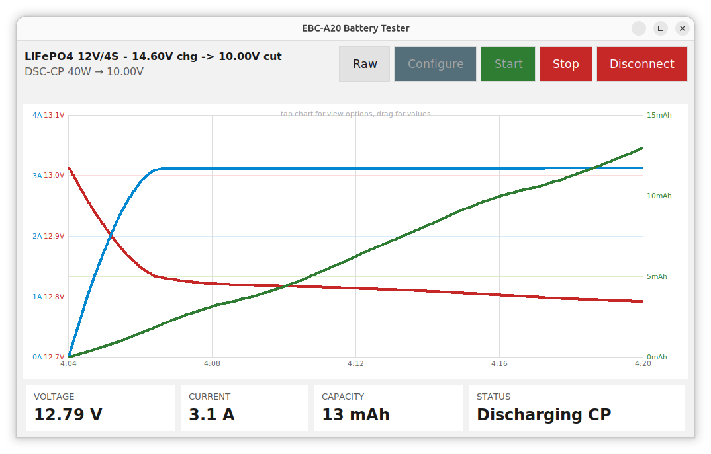
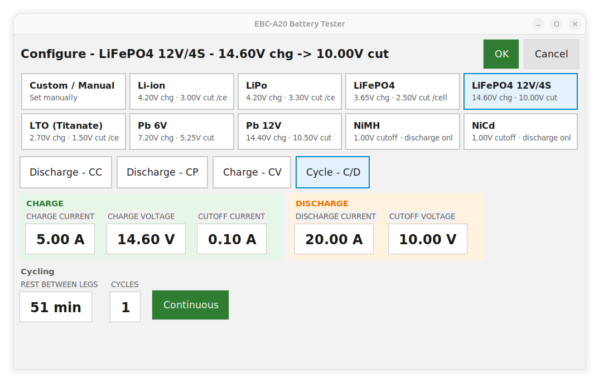
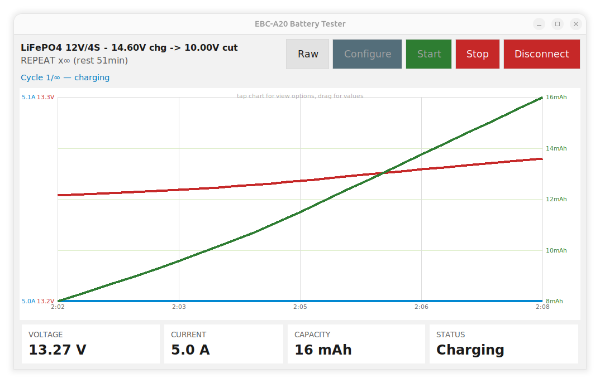
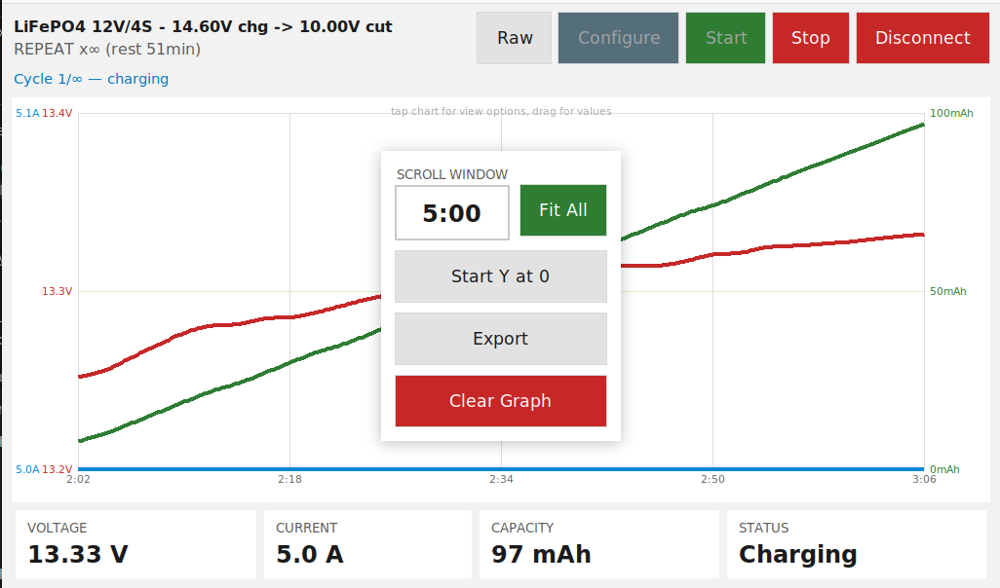
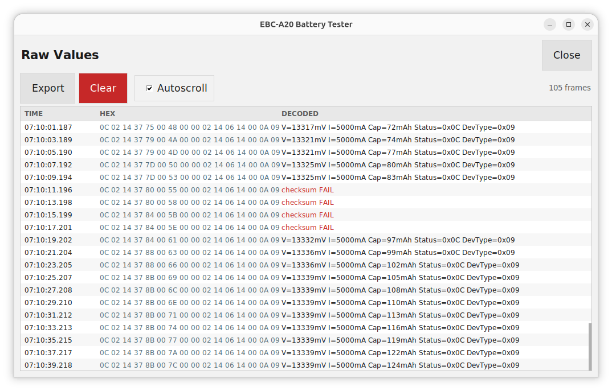
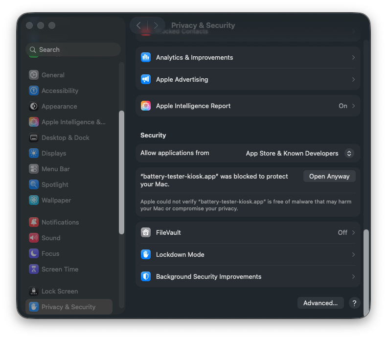

# Cross platform UI for the EBC-A20 Battery Tester
## You can zap your batteries full of ergs on Linux, Mac, or Windows



A native touchscreen app (but you can still use your mouse) for the ZKETECH EBC-A20 battery capacity tester.
Python + Tkinter needs no GPU/OpenGL toolkit, so it's light enough to run
on something as small as a Raspberry Pi Zero touchscreen kiosk, and it's
packaged for desktop Linux, Windows, and macOS too. See **Installing**
below.

| | |
|---|---|
|  |  |
| Configure - battery preset, mode, and parameters | Main screen - live chart, readouts, controls |
|  |  |
| Chart view popup - scroll window, Fit All, zero baseline, Export, Clear | Raw Values - hex alongside decoded fields |


> ## ⚠️ FOR EXPERTS ONLY - READ BEFORE USE
>
> This tool drives real charge/discharge hardware against real batteries.
> Charging and discharging batteries outside their safe parameters can cause
> fire, explosion, toxic gas release, or permanent damage to the battery,
> the EBC-A20, or its surroundings - lithium chemistries especially so.
>
> **If you do not already understand battery chemistry - safe voltage
> cutoffs, C-rates, charge termination behavior, and the specific risks of
> the chemistry you're testing - do not use this tool.** Nothing here
> teaches or verifies that knowledge for you: the settings screen lets you
> pick numbers, it doesn't know what's safe for the cell in front of you.
>
> This software is provided with **no warranty of any kind**, and its
> authors and contributors accept **no responsibility or liability** for
> any damage, injury, fire, or loss arising from its use, including from
> bugs, incorrect readings, or protocol misinterpretation (see the protocol
> verification status below). You use it, and the hardware it controls,
> entirely at your own risk.

## A note on AI assistance and other libraries, etcetera...

`/ai-off` *Claude, don't you dare change this part, or I swear I'll come for you...*

There was a huge amount of AI assistance on this project. Particularly Claude Sonnet.

If you are a python person and you happen to look through the code, you will *very likely* scream at your monitor; and I completely understand.

When AI writes code in .Net (my usual language), it causes me pain.

I will say though that this program probably wouldn't have been made if it wasn't for AI.
Given this program is for a kiosk on a Raspberry Pi Zero 2, Python is the best language choice for me as I *somewhat* know it
 **but** not well enough that I can do what I need to do myself. 

.Net / C# might work, but I haven't had good times trying to make it work on the smaller Pis and I didn't want to do that today.

A massive shoutout to these projects that were obviously assimilated by the borg:

- **[enkiusz's EBC-A20 gist](https://gist.github.com/enkiusz/6408645efd622b8a638a14957cd37f47)**
- **[Kazhuu/ebc-battery-tester](https://github.com/Kazhuu/ebc-battery-tester)**

@Kazhuu @enkiusz - as we say in NZ, thanks heaps!

Anyway, I hope this is useful. Sorry about the mess. 

`/ai-on`

## What it does

- Connect screen: lists serial ports, connect/disconnect, or run against a
  built-in simulator with no hardware attached.
- Main screen: a live chart - Voltage and Current on the left axis,
  Capacity on the right, each independently auto-scaled - numeric readouts
  (voltage, current, capacity, status), and Configure / Raw / Start / Stop /
  Disconnect controls. See **Usage** below for what the chart itself and
  the Raw Values screen can do.
- Settings screen (`ui/settings_screen.py`): pick a battery chemistry
  preset (Li-ion, LiPo, LiFePO4, LTO, 6V/12V lead-acid, NiMH, NiCd) and
  cell count to autofill voltage/cutoff fields, pick a test mode, and set
  that mode's parameters. Modes match the device's own manual: DSC-CC
  (constant-current discharge), DSC-CP (constant-power discharge), CHG-CV
  (constant-voltage charge), and **Repeat** — a configurable N-cycle (or
  continuous) Charge→rest→Discharge→rest loop, orchestrated by this app
  rather than the device's firmware (see `ebc/sequencer.py` — there's no
  confirmed wire command for the device's native single-shot Auto test).
- NiMH/NiCd presets are discharge-only: the device's one charge mode
  terminates on a current-taper-at-fixed-voltage, which can't detect the
  -ΔV peak that NiMH/NiCd charging needs to stop safely. The manual only
  lists lithium and lead-acid for charging; the Settings screen shows a
  warning if you pick NiMH/NiCd with a charge-involving mode, but doesn't
  block it.

Out of scope by design (kept intentionally minimal): saved test profiles
beyond the single active config, mid-test parameter adjustment (the
CONTINUE commands exist in the protocol but aren't wired up).

## Usage

1. **Connect** - pick a serial port, or tap "Use Simulator (no hardware)"
   to try the whole UI without a device attached.
2. **Configure** - choose a battery preset (or Custom) and cell count, pick
   a test mode, and set that mode's parameters. Nothing can run until this
   has been saved at least once - the main screen shows "Not configured"
   until then.
3. **Start / Stop** - starts the configured test on the device; Stop ends
   it (or, in Repeat mode, ends the cycle currently in progress).
4. **The live chart** - Voltage and Current (left axis, each independently
   auto-scaled) and Capacity (right axis) plotted against elapsed time.
   - **Tap the chart** to open its view options: a scrolling time window
     (tap the duration to type a new one, in seconds or minutes) or "Fit
     All" to show the whole run; "Start Y at 0" to force the axes to a zero
     baseline; **Export** to save everything currently held as a CSV, named
     with the test mode/preset and the data's start/end time; **Clear
     Graph** to wipe it (asks for confirmation first). Tap anywhere outside
     the popup to dismiss it.
   - **Drag a finger or the mouse** across the chart for a crosshair and a
     readout of time/voltage/current/capacity at that point.
   - Chart data is kept for the whole session - switching to Configure or
     Raw Values and back doesn't lose it; only a fresh connection or
     "Clear Graph" does.
5. **Raw** (button next to Configure) - a live, virtual-scrolling log of
   every raw frame from the device: hex bytes alongside their decoded
   fields, with Export/Clear buttons and an Autoscroll checkbox. Only
   populated against real hardware - the simulator has no real serial
   frames to show, so this stays empty when using it.

## ⚠️ Protocol verification status

The EBC-A20 has no official protocol documentation. This app's serial
driver (`ebc/protocol.py`, `ebc/device.py`) is built from two independent
public reverse-engineering write-ups:

- https://gist.github.com/enkiusz/6408645efd622b8a638a14957cd37f47
- https://github.com/Kazhuu/ebc-battery-tester (`FRAMES.md`)

They **agree** on frame markers (`0xFA`/`0xF8`), the XOR checksum, and the
base-240 value encoding — and a worked example frame in the second source
checks out against the encoding math, which is good corroboration.

They **disagreed** on serial parity: one says odd, the other says even
(8E1, over a CH340 USB adapter). This driver defaults to **even parity**
(`ebc/protocol.py` → `PARITY`), and **that's now confirmed correct** — the
app connects to a real EBC-A20 and receives valid, checksum-passing frames.

**Confirmed-and-fixed against real hardware:** the live status frame's
voltage field was decoded with an incorrect ×10 factor (a holdover from the
docs' SET-command scaling table, wrongly applied to this different,
live-readback field) — readings were 10x too high. Fixed in
`parse_status_frame()`; see the note there for the underlying mixup.

**Still unverified:** `current_ma` in that same status frame uses the same
×10-decode pattern the voltage field wrongly had — it hasn't been
independently checked against a multimeter/known load yet, so if displayed
current looks off by a clean factor, that's the first place to look. The
CP-discharge (`0x11`) and CV-charge (`0x21`) commands and their status codes
are also still unverified against real hardware.

One more data point: the `Kazhuu/ebc-battery-tester` worked example
(`fa 01 00 14 01 5a 00 00 4b f8`) states its own checksum as
`0x01^0x00^0x14^0x01^0x5a^0x00^0x00 = 0x4b`, but that XOR actually
evaluates to `0x4e` (confirmed both by hand and in code — see the
`build_command()` sanity check below). So the source has an internal typo
in that one example; the plain-XOR algorithm it describes in prose is what
this driver implements, and it's corroborated independently by the
enkiusz gist.

## Installing

No specific OS assumed - grab whichever of these matches your kiosk
machine from the [Releases page](https://github.com/deeja/ebc-a20-touch-ui/releases):

### Linux, including Raspberry Pi

Download `ebc-a20-touch-ui-<arch>.flatpak` (`arch` one of `x86_64`/
`aarch64` - a 64-bit Pi, e.g. Zero 2 W or later on a 64-bit OS; the original
32-bit Pi Zero isn't covered, since the Flatpak freedesktop runtime doesn't
build for armhf):

```bash
flatpak install --user ./ebc-a20-touch-ui-<arch>.flatpak
flatpak run io.github.deeja.EbcA20TouchUi
```

(or find it in your app menu). Fullscreen and no-cursor kiosk mode are
baked in - nothing else to set.

If the app can't see the port or connecting fails with a permissions error,
your user likely needs the `dialout` group (Flatpak's sandboxing doesn't
change who's allowed to open the device node on the host):

```bash
sudo usermod -aG dialout $USER
```

then log out and back in.

### Windows

Download `ebc-a20-touch-ui.exe`, then:

```bash
ebc-a20-touch-ui.exe --kiosk
```

(drop `--kiosk` for a normal windowed run)

### macOS

Download and unzip `ebc-a20-touch-ui-macos.zip`, right-click → Open
the first time - it's an unsigned build, so Gatekeeper will otherwise
refuse to launch it - then:



```
open ebc-a20-touch-ui.app --args --kiosk
```

## Development or running from the repo:

On a dev machine (Windows/Mac/Linux):

```bash
pip install -r requirements.txt
python main.py
```

Other dependencies, beyond what `pip install` covers:

- **Tkinter** - not a pip package, comes bundled with Python on Windows/Mac;
  on Debian/Ubuntu Linux install it separately: `sudo apt install python3-tk`.
- **Docker** - only if you want to run `deploy/test-local-ui.sh` (the app in
  a container, forwarded to your host X server) instead of installing
  `python3-tk`/`pyserial` locally.
- **PyInstaller** (`pip install pyinstaller`) - only needed to build the
  Windows `.exe`/macOS `.app` yourself instead of grabbing one from
  Releases; see the `build-windows-exe`/`build-macos-app` jobs in
  `.github/workflows/release.yml` for the exact build command.
- **flatpak** and **flatpak-builder** - only needed to build the Linux
  `.flatpak` yourself instead of grabbing one from Releases; see
  `deploy/build-flatpak-local.sh` and `flatpak/io.github.deeja.EbcA20TouchUi.yml`.